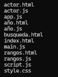

# FILTRO JAVASCRIPT

Se realizó el diseño, maquetación y código del trabajo asignado como filtro del módulo JavaScript.

### Descripción

La página web busca y visualiza las películas y series que el usuario necesite consultar a manera de vista de un panel tipo dashboard.

### Tecnologías utilizadas
|Nombre|Icon|
|--|--|
|HTML5||
|CSS||
|JavaScript||

### Estructura del proyecto

### Características

|Nombre|Descripción|
|--|--|
|[index.html]|estos contienen el código principal (varian sus nombres según las páginas).|
|[style.css]|este contiene el diseño para la realización de las páginas.|
|[script.js]|estos contienen los consumos necesarios para mostrar la información necesaria en la página creada (varian sus nombres según las páginas).|
|[readme.md]| contiene la explicación e información de la realización del filtro.|

### Instrucciones

1. Clonar el repositorio cargado en GitHub
2. Abrir en la nube el archivo index.html en un navegador web.

### Desarrollado por:

El trabajo fue desarrollado por Alejandra Machuca Molina, estudiante de Campuslands como filtro del módulo JavaScript.